# Bus booking interface project

This project describes the interface for bus ticket booking.

## Pages already built in the project

-   Homepage interface

  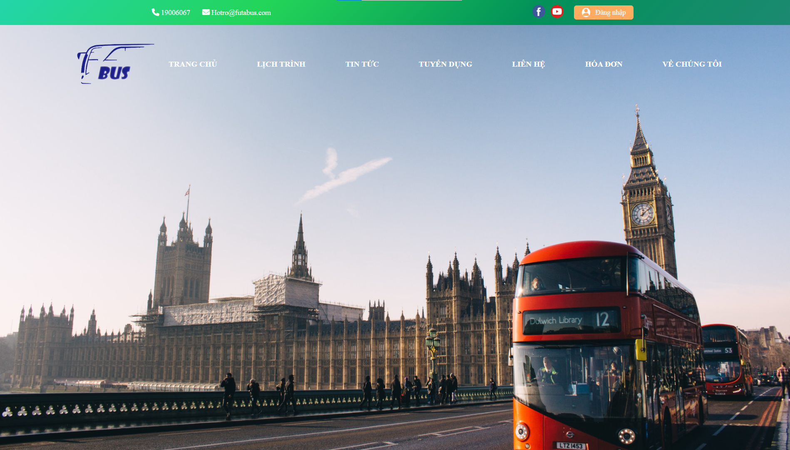
  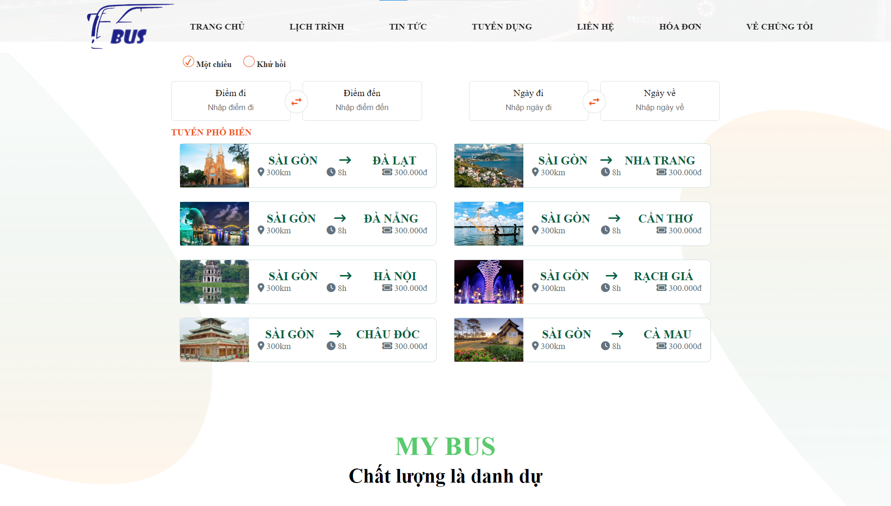
  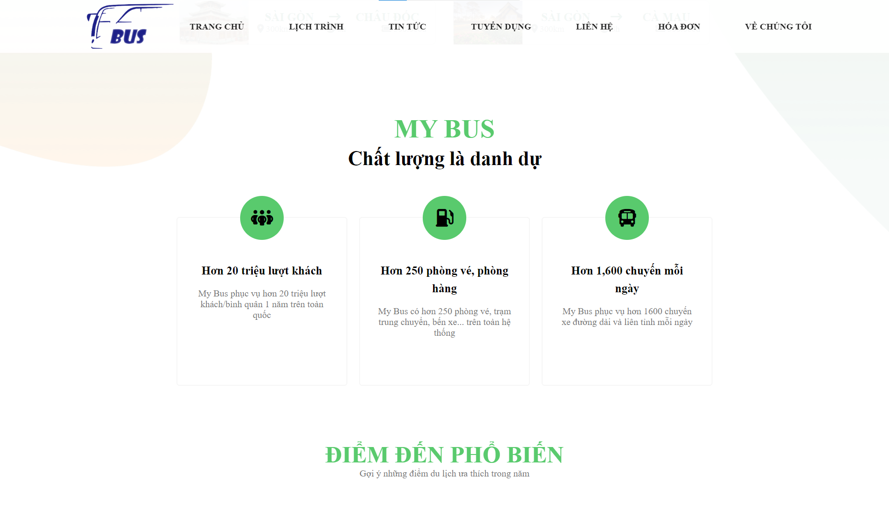
  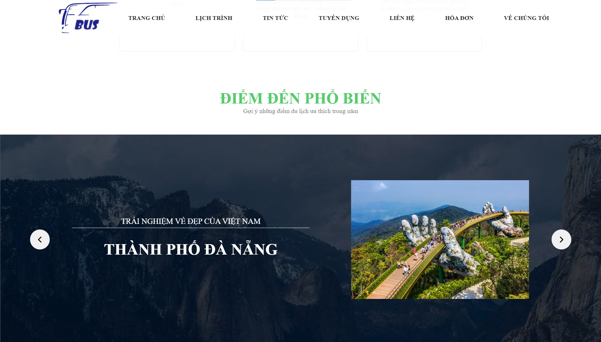
  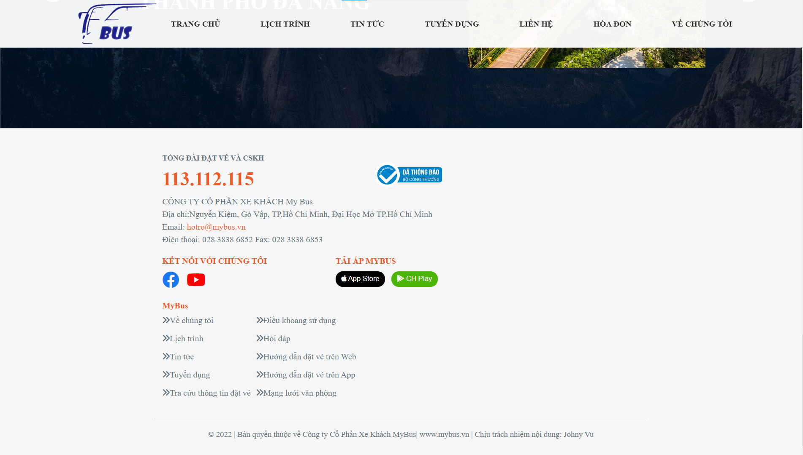

## Calendar interface

   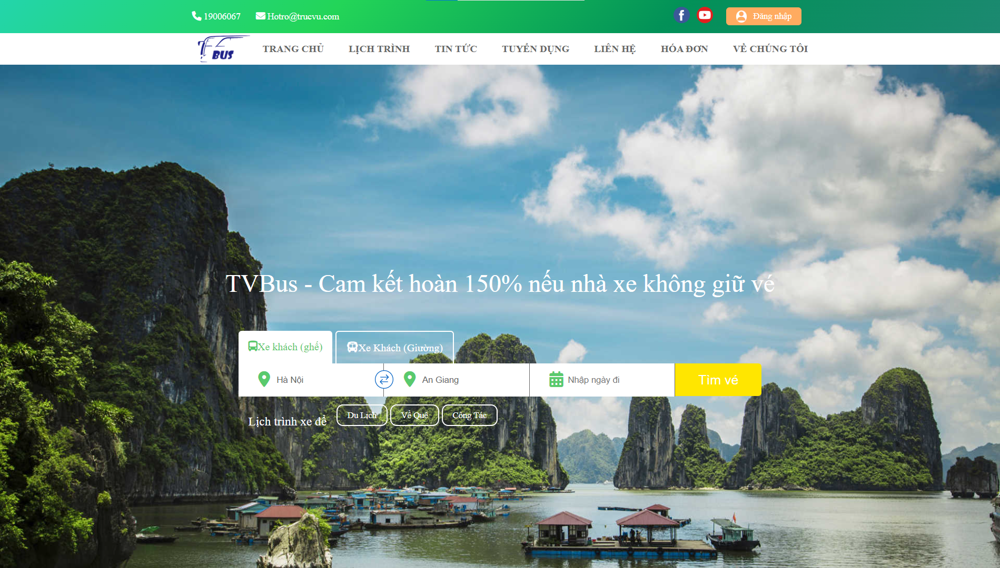
   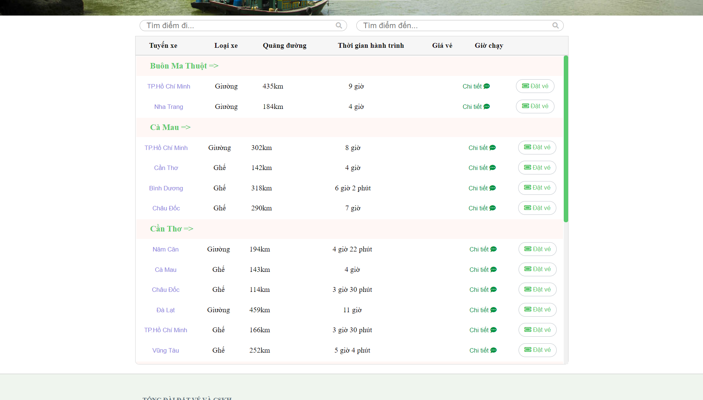
   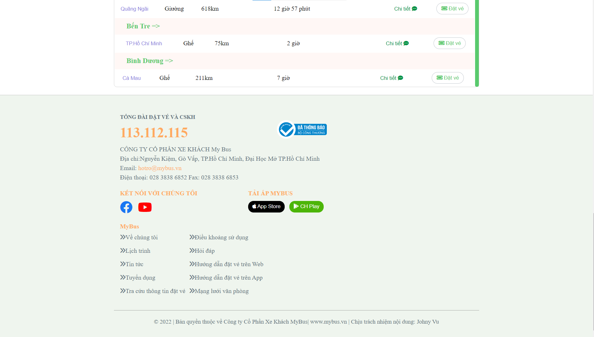

## News interface

   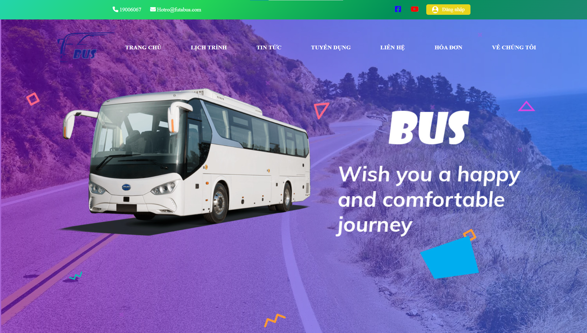
   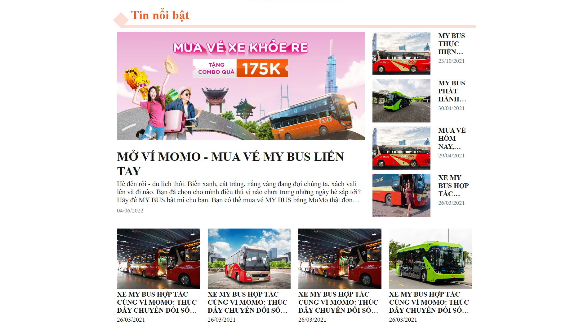
   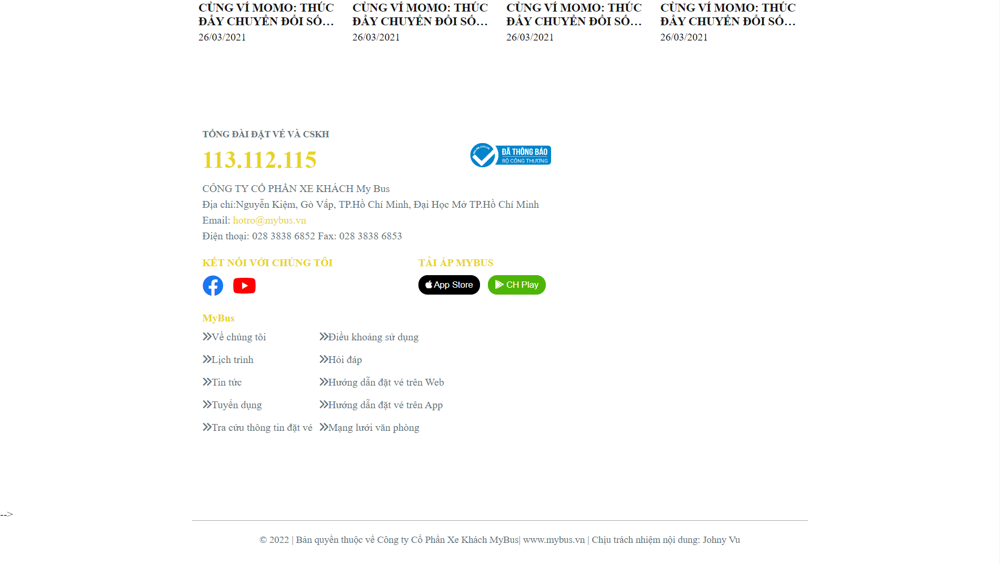

## Recruitment interface

   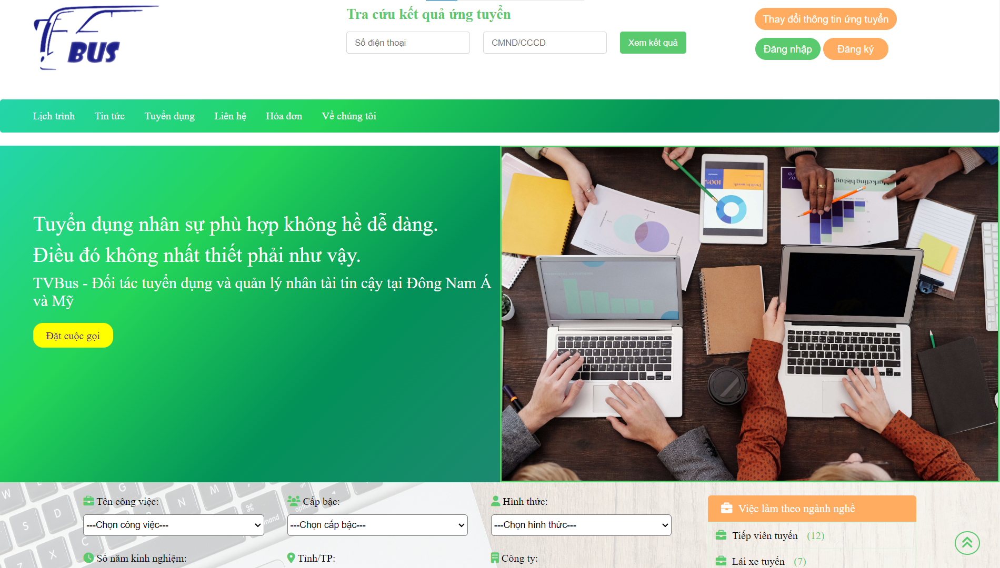
   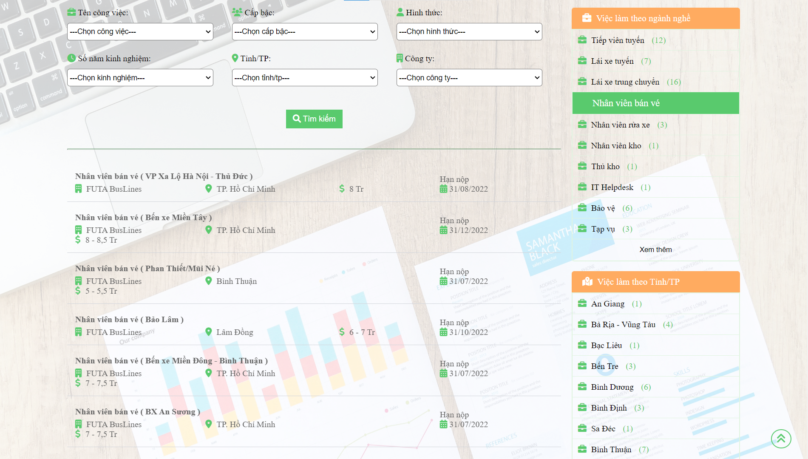
   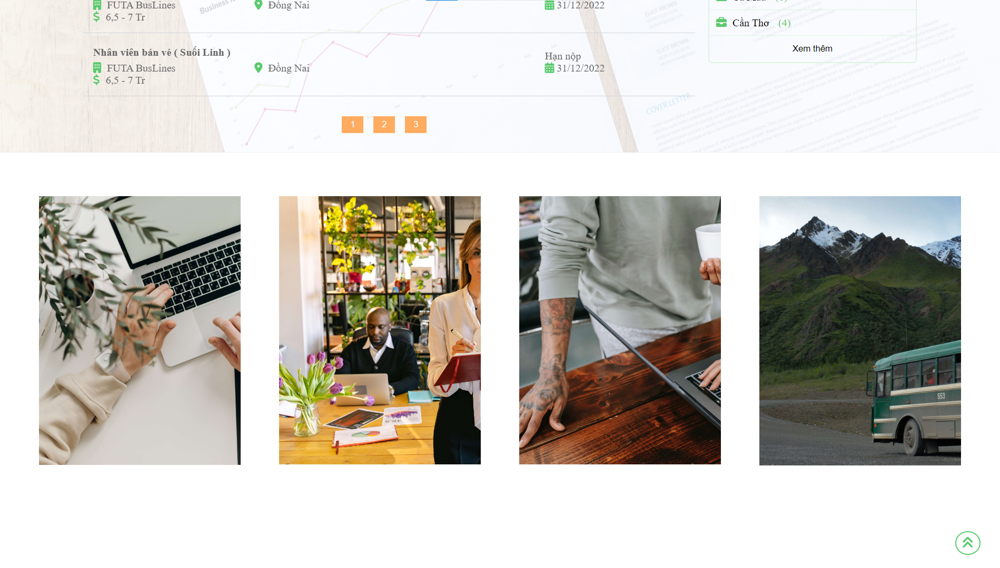
   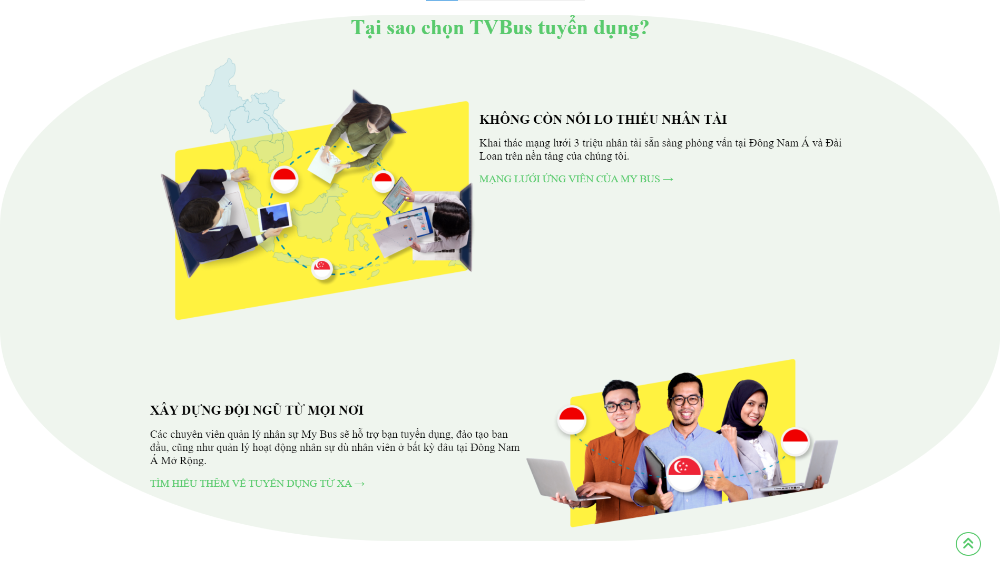

